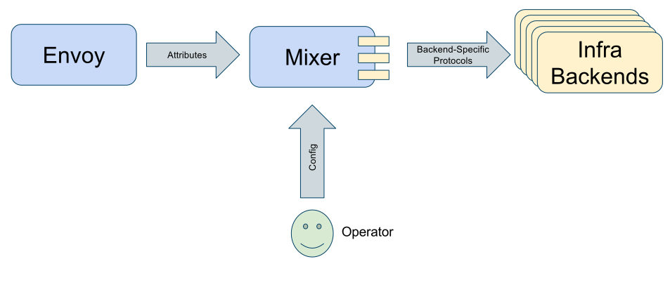

# Mixer 的适配器模型

> Mixer 插件架构概述

作者：Martin Taillefer

原文地址：https://istio.io/blog/2017/adapter-model.html

Istio 0.2 引入了新的 Mixer 适配器模型，从而具有了更大的灵活性去接入各种基础设施后端。本文尝试讲述这一模型及其工作机制。

## 为什么是适配器模型？

各种基础设施都提供了用于支持服务构建的功能，例如访问控制、遥测、配额、计费等等。传统服务会直接和这些后端系统打交道，和后端紧密耦合，并集成其中的个性化语义以及用法。

Mixer 服务构成了基础设施和 Istio 之间的抽象层。Istio 组件和运行于 Service Mesh 中的服务，借助 Mixer 的能力就能在不直接访问后端接口的情况下和这些后端进行交互。

Mixer 除了作为应用和基础设施之间的隔离层之外，操作者还可以借助 Mixer 的中介模型，注入或者操作应用和后端之间的策略，例如哪些数据需要报告给哪些后端、哪些后端提供认证等。

每种后端都有各自不同的接口和操作方式，因此 Mixer 需要有代码来支持这种差异，我们称这些内容为[适配器](https://github.com/istio/istio/wiki/Mixer-Adapter-Dev-Guide)。

适配器是 Go 包的形式存在的，直接链接到 Mixer 二进制中。如果缺省适配器无法满足特定的用例，创建自己的适配器也是比较简单的。

## 哲学

本质上 Mixer 这个模块就是用来处理属性和路由的。代理把[属性](../../docs/concepts/policy-and-control/attributes.md)作为前置检查和遥测报告的一部分发送出来，转换为对适配器的一系列调用。运维人员提供了用于描述如何将属性转换为适配器指令的配置。

配置是一个复杂的任务。有证据表明，绝大多数的服务中断都来自于配置错误。为了解决这一问题，Mixer 加入了很多限制来避免错误。例如在配置中使用强类型，以此保障在任何上下文中都只能使用有意义的属性或表达式。

## Handler：适配器的配置

Mixer 使用的每个适配器都需要一些配置来进行操作。一般来说适配器需要一些数据进项实例化，例如后端的 URL、认证信息、缓存选项等等。每个适配器使用一个 [protobuf](https://developers.google.com/protocol-buffers/) 消息来定义所需的配置数据。

可以通过创建 [Handler](../../docs/concepts/policy-and-control/mixer-config.md#handlers) 的方式来为适配器提供配置。Handler 就是一套能让一个适配器就绪的完整配置。对同一个适配器可以有任意数量的 Handler，这样就可以在不同场景下复用了。

> 例如：memquota 适配器，可以配置多个不同的 Handler，用于进行不同的限制。
> 或者同类服务的不同服务端点的实例

## Template：适配器的输入结构（Schema）

一个请求到达 Mesh 中的服务时，一般会发生两次对 Mixer 的调用，一次是前置检查，一次是遥测报告。每一次这种调用，Mixer 都需要调用一个或更多的适配器。不同的适配器需要不同的数据块作为输入来进行处理。例如日志适配器需要日志输入，指标适配器需要指标输入，认证适配器需要凭据输入。适配器在请求时消费的数据就是由 Mixer 的 [Template](https://istio.io/docs/reference/config/mixer/template/) 来描述的。

每个 Template 对应一个 protobuf 消息。在运行时一个 Templates 描述了一系列的发送给一或多个适配器的数据。适配器和 Template 是多对多的关系，其对应关系由开发者决定。

[Metric（指标）](https://istio.io/docs/reference/config/mixer/template/metric.html)和[Logentry（日志条目）](https://istio.io/docs/reference/config/mixer/template/logentry.html)是最重要的两个 Template，分别用于描述工作负载的一个指标和一条日志。

## Instances ：属性映射

创建 [Instance](https://istio.io/docs/concepts/policy-and-control/mixer-config.html#instances) 用于决定把什么数据发送给特定的适配器。Instance 决定了 Mixer 如何把来自代理的属性拆分为各种数据然后分发给不同的适配器。

一般来说需要使用 [Attribute Expression](../../docs/concepts/policy-and-control/mixer-config.md#attribute-expressions) 来创建 Instance。属性表达式的功能是使用属性和常量来生成结果数据，用于给 Instance 字段进行赋值。

每个 Instance 字段都有类型，类型的定义来自于 Template，每个[属性也有类型](https://github.com/istio/api/blob/master/mixer/v1/config/descriptor/value_type.proto)，然后每个属性表达式还是有类型。只有兼容的数据类型才能进行赋值。例如不能把整数型的表达式赋值给字符串字段。强类型设计的目的就是降低配置出错引发的风险。

## Rules（规则）：把数据分发给适配器

拼图的最后一块就是 [Rules](../../docs/concepts/policy-and-control/mixer-config.html#rules)，他负责告诉 Mixer，哪个 Instance 应该在什么时候发送给哪个 Handler。每个 Rule 包含了一系列的 Instance，以及将要发送这些 Instance 的目标 Handler。Mixer 被触发以后，就会调用指定的 Handler，令其处理指定的 Instance。

Rules 包含有匹配断言，这一断言是一个返回布尔值的属性表达式。只有断言成功的属性表达式才会触发 Handler。

## 未来

我们一直在尝试提高适配器的使用和开发的端到端体验。例如计划中包含很多特性来帮助用户更方便的创建 Tempalte。另外表达式语言也在不断地发展和成熟。

长期来看，我们在评估如何让适配器不再直接连入 Mixer 的方式，这样会更加方便的进行开发和使用。

## 结论

新的 Mixer 适配器模型，设计目的是提供一个有弹性的框架，以此支持开放的基础设施后端。

Handler 为适配器提供了配置，Template 在运行时能够决定不同的适配器需要的数据种类，数据经由 Instance，被 Rules 发送给一个或多个 Handler。

[策略和控制](../../docs/concepts/policy-and-control/)中介绍了更多的 Mixer 架构的内容，[Mixer 参考](../../docs/reference/config/mixer/)包含更多的 Template、Handler 以及 Rules 的内容。[Bookinfo 示例中](https://github.com/istio/istio/tree/master/samples/bookinfo/kube)提供了对应的示例文件。
