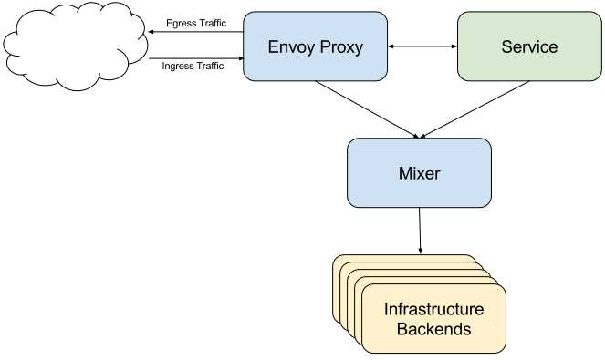
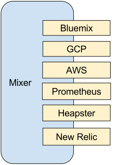
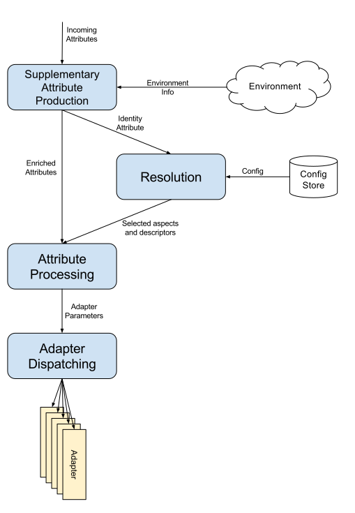

# Mixer

本节解释Mixer的角色和总体架构。

## 背景

基础设施后端设计用于提供用于构建服务的支持功能。它们包括访问控制系统，遥测捕获系统，配额执行系统，计费系统等。传统服务会直接和这些后端系统打交道，和后端紧密耦合，并集成其中的个性化语义以及用法。

Mixer在应用程序代码和基础架构后端之间提供通用中介层。它的设计将策略决策移出应用层，用运维人员能够控制的配置取而代之。应用程序代码不再将应用程序代码与特定后端集成在一起，而是与Mixer进行相当简单的集成，然后Mixer负责与后端系统连接。

Mixer的设计目的是改变层次之间的边界，以此来降低总体的复杂性。从服务代码中剔除策略逻辑，改由运维人员进行控制。

Mixer 提供三个核心功能：

- **前提条件检查**。允许服务在响应来自服务消费者的传入请求之前验证一些前提条件。前提条件可以包括服务使用者是否被正确认证，是否在服务的白名单上，是否通过ACL检查等等。

- **配额管理**。 使服务能够在分配和释放多个维度上的配额，配额这一简单的资源管理工具可以在服务消费者对有限资源发生争用时，提供相对公平的（竞争手段）。频率控制就是配额的一个实例。

- **遥测报告**。使服务能够上报日志和监控。在未来，它还将启用针对服务运营商以及服务消费者的跟踪和计费流。

这些机制的应用是基于一组[属性](attributes.md)的，每个请求都会将这些属性呈现给Mixer。在Istio中，这些属性来自于Sidecar代理（一般是Envoy）的每一次请求。

## 适配器

Mixer是高度模块化和可扩展的组件。他的一个关键功能就是把不同后端的策略和遥测系统的细节抽象出来，让Envoy以及基于Istio的服务能够独立于这些后端，从而保持他们的可移植性。

Mixer在处理不同基础设施后端的灵活性是通过使用通用插件模型实现的。单个的插件被称为*适配器*，它们允许Mixer与不同的基础设施后端连接，这些后台可提供核心功能，例如日志，监控，配额，ACL检查等。适配器使Mixer能够暴露一个一致的独立于后端的API。通过配置能够决定在运行时使用的确切的适配器套件，并且可以轻松指向新的或定制的基础设施后端。

## 配置状态

Mixer的核心运行时方法（`Check`和`Report`）都接受来自输入的一组属性。Mixer的当前配置会根据输入属性来决定每个方法的工作内容。为此，服务运维工作包括：

- 配置一组*handelr*。Handler是配置完成的Adapter（Adapter是一种二进制插件，[下面会提到](mixer.md#adapters)）。给`statsd`Adapter设置一个statsd后端的IP地址，就是一个Handler配置的例子。

- 基于属性和常量，为Mixer配置一组*Instance*，Instance表达了一套提供给Adapter处理的数据。例如通过配置让Mixer使用`destination.service`和`response.code`生成`request_code`指标。

- 配置一套*Rule*，Mixer在每次请求时都会执行这些Rule。Rule由一个匹配表达式和对应的Action构成。Mixer根据匹配表达式来判断将要执行的Action。Action中设置了需要生成的Instance和处理这些Instance所需要的Handler。例如一个Rule要求Mixer在所有的`report`过程中，把`requestcount`instance发送给`statsd`Handler。

需要上述配置状态才能让Mixer知道如何处理传入的属性并分发到适当的基础设置后端。

有关Mixer配置模型的详细信息，请参阅 [此处](./mixer-config.md)。

## 请求阶段

当一个请求进入Mixer时，它会经历一些不同的处理阶段：

- **生成补充属性**。在Mixer中发生的第一件事是运行一组全局配置的适配器，这些适配器负责引入新的属性。这些属性与来自请求的属性组合，以形成操作的全部属性集合。

- **决议**。第二阶段是评估属性集，以确定应用于请求的有效配置。请参阅[此处](./mixer-config.md#决议)了解这一阶段的的工作原理。有效的配置确定可用于在后续阶段处理请求的一组切面和描述符。

- **属性处理**。第三阶段拿到属性总集，然后产生一组**适配器参数**。[这里](./mixer-config.md)描述了使用简单的声明来初始化属性处理的过程。

- **适配器调度**。决议阶段建立可用切面的集合，而属性处理阶段创建一组适配器参数。适配器调度阶段调用与每个切面相关联的适配器，并传递这些参数给它们。

## 下一步

阅读[博客](https://istio.io/blog/mixer-adapter-model.html)内容，理解Mixer的适配器模型。
