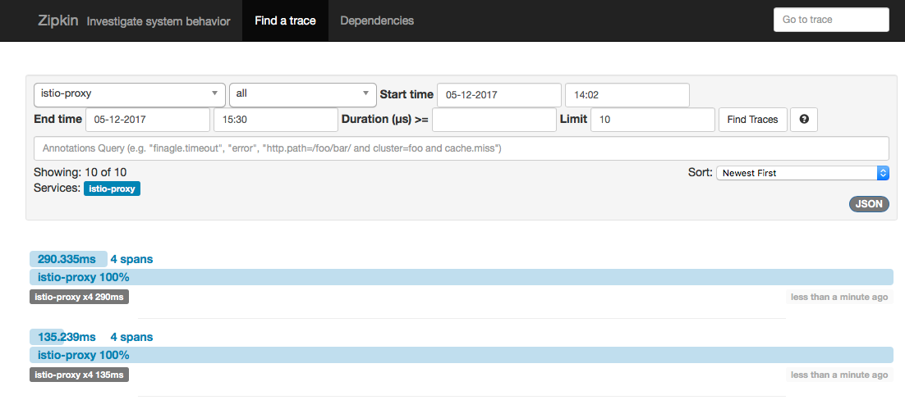
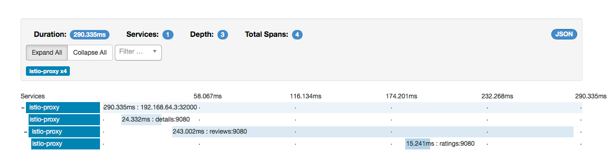

# 分布式调用链跟踪

本章介绍如何使用[Zipkin](http://zipkin.io)或[Jaeger](https://uber.github.io/jaeger/)收集被Istio纳管的应用程序的调用链信息。 完成本章后，你会理解有关应用程序的所有假设以及如何使其参与跟踪，无论您使用何种语言/框架/平台构建应用程序。

[BookInfo](https://istio.io/docs/guides/bookinfo.html)示例用作此任务的示例应用程序。

## 环境准备
---

- 参照安装指南安装Istio。

如果您在安装过程中未启动Zipkin或Jaeger插件，则可以运行以下命令启动：

启动Zipkin：
  
```
kubectl apply -f install/kubernetes/addons/zipkin.yaml
```

启动Jaeger：
  
```
kubectl apply -n istio-system -f https://raw.githubusercontent.com/jaegertracing/jaeger-kubernetes/master/all-in-one/jaeger-all-in-one-template.yml
```

- 部署[BookInfo](https://istio.io/docs/guides/bookinfo.html)示例应用程序。

## 访问仪表盘
---

### Zipkin

设置Zipkin仪表板URL的访问权限通过端口转发：
  
```
kubectl port-forward -n istio-system $(kubectl get pod -n istio-system -l app=zipkin -o jsonpath='{.items[0].metadata.name}') 9411:9411 &
```

然后使用浏览器访问 http://localhost:9411。
  
### Jaeger

设置Jaeger仪表盘URL的访问权限通过端口转发：
  
```
kubectl port-forward -n istio-system $(kubectl get pod -n istio-system -l app=jaeger -o jsonpath='{.items[0].metadata.name}') 16686:16686 &
```

然后使用浏览器访问 http://localhost:16686。

## 使用BookInfo例子生成调用链跟踪
---

BookInfo的应用程序启动和运行后，通过访问```http://$GATEWAY_URL/productpage```一次或多次生成调用链信息。

如果你查看仪表板，会看到类似以下的内容：

</img>
</img>

如果你点击调用链堆栈中（最近的）最近的一条，您应该看到刷新```/ productpage```后最新的详细信息。页面看起来像这样：

</img>
</img>

像您看到的，调用链由spans组成，其中每个span对应于使用```/ productpage```去调用BookInfo服务。 因为调用链堆栈是由Istio边车（Envoy代理）包装实际的服务完成的，所以每个服务具有相同的标签```istio-proxy```。右侧的目的地标签每一行标识该服务的调用耗时。

第一行表示```productpage```服务被外部调用。```192.168.64.3:32000```标签是外部请求的主机信息（即$GATEWAY_URL）。 从调用堆栈中可以看到，请求总共耗时大约290毫秒完成。 在执行过程中，```productpage```调用```details```服务，耗时约24ms，然后调用```review```服务。```review```服务耗时约243毫秒，其中包括一个15毫秒的```ratings```服务。

## 理解下发生了什么
---

尽管Istio代理能够自动发送spans，但他们需要一些标识来将整个调用链关系联系起来。应用程序需要传入合适的HTTP header信息，便于代理发送span信息到Zipkin或Jaeger时，span可以准确地把每次调用关联起来。

为此，应用程序需要从传入的请求中收集如下的header信息并将其传入到每个传出请求：

- ```x-request-id```
- ```x-b3-traceid```
- ```x-b3-spanid```
- ```x-b3-parentspanid```
- ```x-b3-sampled```
- ```x-b3-flags```
- ```x-ot-span-context```

如果您看了示例的服务，可以看到productpage应用（Python应用）从HTTP请求中提取所需的header信息：

<pre><code>def getForwardHeaders(request):
    headers = {}

    user_cookie = request.cookies.get("user")
    if user_cookie:
        headers['Cookie'] = 'user=' + user_cookie

    incoming_headers = [ 'x-request-id',
                         'x-b3-traceid',
                         'x-b3-spanid',
                         'x-b3-parentspanid',
                         'x-b3-sampled',
                         'x-b3-flags',
                         'x-ot-span-context'
    ]

    for ihdr in incoming_headers:
        val = request.headers.get(ihdr)
        if val is not None:
            headers[ihdr] = val
            #print "incoming: "+ihdr+":"+val

    return headers
</code></pre>

示例中reviews应用(Java应用)也做了类似的事情：

<pre><code>    @GET
    @Path("/reviews")
    public Response bookReviews(@CookieParam("user") Cookie user,
                                @HeaderParam("x-request-id") String xreq,
                                @HeaderParam("x-b3-traceid") String xtraceid,
                                @HeaderParam("x-b3-spanid") String xspanid,
                                @HeaderParam("x-b3-parentspanid") String xparentspanid,
                                @HeaderParam("x-b3-sampled") String xsampled,
                                @HeaderParam("x-b3-flags") String xflags,
                                @HeaderParam("x-ot-span-context") String xotspan) {
      String r1 = "";
      String r2 = "";

      if(ratings_enabled){
        JsonObject ratings = getRatings(user, xreq, xtraceid, xspanid, xparentspanid, xsampled, xflags, xotspan);</pre></code>
在应用程序中调用其他服务时，请确保包含这些header信息。

## 清除
---

- 删除调用链跟踪的配置：

如果使用Zipkin，请运行以下命令进行清理

<pre><code>kubectl delete -f install/kubernetes/addons/zipkin.ya</pre></code>

如果使用Jaeger，请运行以下命令进行清理：

<pre><code>kubectl delete -f https://raw.githubusercontent.com/jaegertracing/jaeger-kubernetes/master/all-in-one/jaeger-all-in-one-template.yml</pre></code>

- 如果您不打算探索任何后续任务，请参阅BookInfo清理说明关闭应用程序。

## 进一步阅读
---
了解有关监控和日志的更多信息


