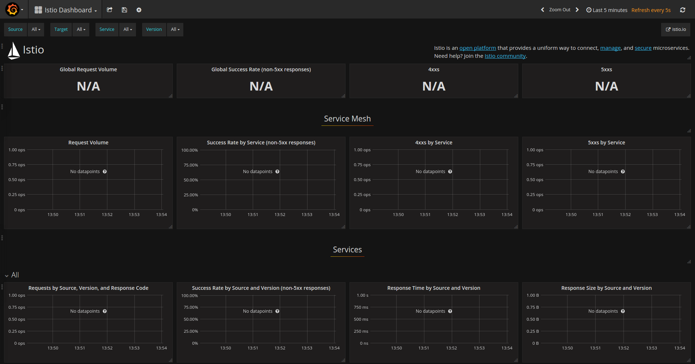

# 使用Grafana呈现Metrics

这一任务展示了如何设置和使用Istio Dashboard对Service Mesh中的流量进行监控。作为这一任务的一部分，需要安装Grafana的Istio插件，这样就可以使用Web界面来观察Service Mesh的通信数据了。

## 开始之前

- 在集群上[安装Istio](../../setup/)并部署一个应用。

- 安装Prometheus插件。

`kubectl apply -f install/kubernetes/addons/prometheus.yaml`

Istio Dashboard必须有Prometheus插件才能工作。

## 查看Istio Dashboard

1.要在Dashboard上查看Istio的Metrics，首先要安装Grafana。

在Kubernetes环境下，执行下面的命令：

`kubectl apply -f install/kubernetes/addons/grafana.yaml`

2.查看集群上运行的服务。

在Kubernetes环境下，执行下面的命令：

`kubectl -n istio-system get svc grafana`

会得到大致如下的输出：

~~~
NAME      CLUSTER-IP      EXTERNAL-IP   PORT(S)    AGE
grafana   10.59.247.103   <none>        3000/TCP   2m
~~~

3.使用Grafana，打开Istio的Dashboard

如果是Kubernetes环境，执行下面的命令：

` kubectl -n istio-system port-forward $(kubectl -n istio-system get pod -l app=grafana -o jsonpath='{.items[0].metadata.name}') 3000:3000 &`

然后使用浏览器浏览[http://localhost:3000/dashboard/db/istio-dashboard](http://localhost:3000/dashboard/db/istio-dashboard)：

Istio Dashboard大概是这样的：

1.向Mesh发起通信。
如果是BookInfo示例，使用浏览器打开`http://$GATEWAY_URL/productpage`，或者使用控制台命令：

`curl http://$GATEWAY_URL/productpage`

刷新几次浏览器，或者重复执行几次命令，会产生一定数量的流量：

再次打开Istio Dashboard，会看到流量的效果：

注意：`$GATEWAY_URL`的来由可参看[BookInfo指南](../../guides/bookinfo.md)。

## 关于Grafana插件

Grafana插件是一个预先配置好的Grafana实例。我们修改了基础镜像(`grafana/grafana:4.1.2)`)，在其中加入了Prometheus数据源，以及一个Istio Dashboard。Istio和Mixer的初始安装中就会初始化一个缺省的（对所有服务生效的）全局Metrics。Istio Dashboard就是依赖这一初始环境以及Prometheus插件来完成工作的。

Istio Dashboard由三个部分组成：

1. 全局汇总视图：在Service Mesh中发生的HTTP请求流量的汇总。

2. Mesh汇总视图：比全局汇总视图详细一些，可以根据服务进行过滤。

3. 单一服务视图：这一部分提供了单一服务视角下，在Service Mesh内部的HTTP和TCP请求和相应情况。

[Grafana官方文档](http://docs.grafana.org/)介绍了更多关于创建、配置和编辑Dashboard的内容。

## 清理

- 在Kubernetes环境中，执行下面的命令可以移除Grafana插件。

`kubectl delete -f install/kubernetes/addons/grafana.yaml`

- 停止所有的`kubectl port-forward`进程：

`killall kubectl`

- 如果不想继续后续内容，参考[BookInfo清理](../../guides/bookinfo.md#清理)的介绍来停掉应用。
